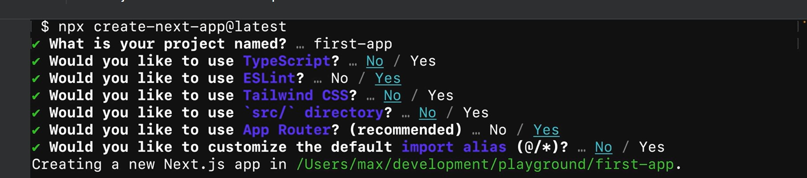

# install nodejs
- Download from [LTS](https://nodejs.org/en)
- check installation:
  - ```npm --version```
  - ```node --verion```

# Create sample nextjs project
- Refer from [nextjs](https://nextjs.org/docs/getting-started/installation)
- 
- Test app: ```npm run dev```
